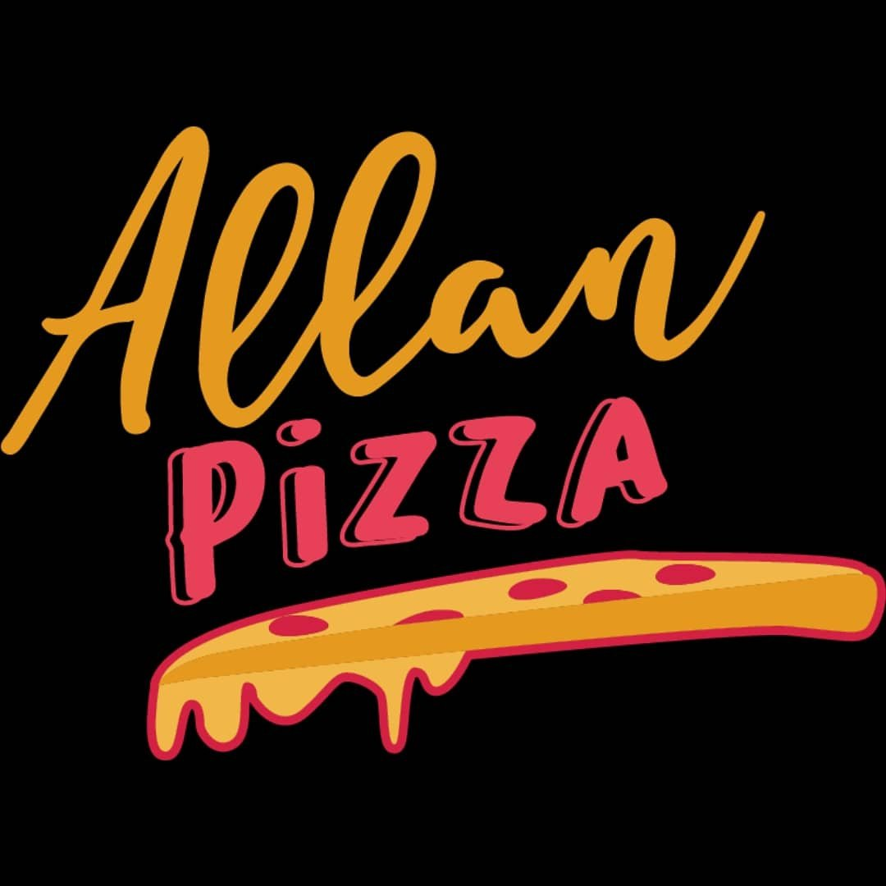

# Allan Pizza - Aplicación Android

Aplicación Android para la gestión de pedidos de una pizzería, diseñada para ofrecer una experiencia de usuario intuitiva y eficiente.

## Equipo de Desarrollo

| Nombre Completo | Carnet | Perfil de GitHub | Rol |
|-----------------|--------|------------------|-----|
| Josué Eduardo García Estrada | GE240098 | [@JosueGarcia-UDB](https://github.com/JosueGarcia-UDB) | Desarrollador Backend & Mobile |
| Jeremy Edenilson Flores Portillo | FP240479 | [@JeremyFlxress](https://github.com/JeremyFlxress) | Desarrollador Backend & Mobile |
| Edgar Josué Gómez Meléndez | GM240279 | [@EdgarMelendez06](https://github.com/EdgarMelendez06) | Desarrollador Frontend & DBA |
| Oscar Daniel Soto Jovel | SJ241841 | [@DanielSoto](https://github.com/DanielSoto) | Desarrollador Frontend & Diseñador |

## Recursos del Proyecto

- **Trello**: [Tablero de gestión del proyecto](https://trello.com/invite/b/67cb724acd02a97d37bb1e9b/ATTI0fc86dc9435812a25a9a8b66b1739481BA223874/app-de-allan-pizza)  
- **Figma**: [Mockups y diseños](https://www.figma.com/design/5MvnZQ4va7b3ikI2Uj9w3u/DSM-ALLAN-S-PIZZA-MOCKUPS?node-id=130-152&t=MSgx7TyPg97PzQpu-1)

## Licencia

Este proyecto está licenciado bajo la [Creative Commons Attribution-NonCommercial-NoDerivatives 4.0 International Public License](https://creativecommons.org/licenses/by-nc/4.0/deed.es).